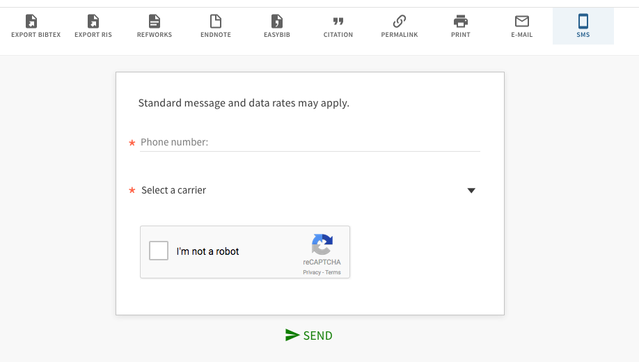

# primo-explore-send-sms

[](https://www.npmjs.com/package/primo-explore-send-sms)

## Features
Adds an "SMS" action to the actions menu that opens a form for the user to send themselves a text message with item details. Uses Primo's email API to send item details to carrier SMS gateways to convert them to text messages.

### Screenshot


## Install
1. Make sure you've installed and configured [primo-explore-devenv](https://github.com/ExLibrisGroup/primo-explore-devenv).
2. Navigate to your template/central package root directory. For example:
    ```
    cd primo-explore/custom/MY_VIEW_ID
    ```
3. If you do not already have a `package.json` file in this directory, create one:
    ```
    npm init -y
    ```
4. Install this package:
    ```
    npm install primo-explore-send-sms --save
    ```

alternatively, just copy `dist/module.js` into your package's `custom.js` file.

**n.b.** This customization depends on [primo-explore-custom-actions](https://github.com/alliance-pcsg/primo-explore-custom-actions). If you didn't install using `npm`, you'll need to also manually install the custom actions package.

## Usage
Once this package is installed, add `sendSms` as a dependency for your custom module definition.

```js
var app = angular.module('viewCustom', ['sendSms'])
```
Note: If you're using the `--browserify` build option, you will need to first import the module with:

```javascript
import 'primo-explore-send-sms';
```
Activate the customization by adding an `<sms-action />` element as part of your `prmActionListAfter` component template:
```js
app.component('prmActionListAfter', {template: '<sms-action />'})
```

#### Configuration

You can configure the look of the action and the available SMS carriers by passing a new options object as `smsOptions` - see below for an example.
- The `smsOptions.smsAction` property governs the look of the action - see [primo-explore-custom-actions](https://github.com/alliance-pcsg/primo-explore-custom-actions) for more info on how to customize it.
- The `smsOptions.smsCarriers` property governs the available SMS carriers, and is a map of carrier options to their respective [SMS gateway](https://en.wikipedia.org/wiki/SMS_gateway) addresses.

You can see the default options for both properties by looking at `src/js/smsOptions.value.js` in this repository.

### Example

The example below activates the customization and changes the action label to 'Text Me'. It also moves the action to the left side of the list, and shortens the list of available SMS carriers.

```js
var app = angular.module('viewCustom', ['customActions'])

app.component('prmActionListAfter', {template: '<sms-action />'})

app.value('smsOptions', {
    smsAction: {
      name: 'send_sms',
      label: 'Text Me',
      index: 0,
      icon: {
        icon: 'ic_smartphone_24px',
        iconSet: 'hardware',
        type: 'svg',
      },
    },
    smsCarriers: {
      'ATT': 'txt.att.net',
      'T-Mobile': 'tmomail.net',
      'Verizon': 'vtext.com',
    },
})
```

<!-- ## Running tests
1. Clone the repo
2. Run `npm install`
3. Run `npm test` -->
